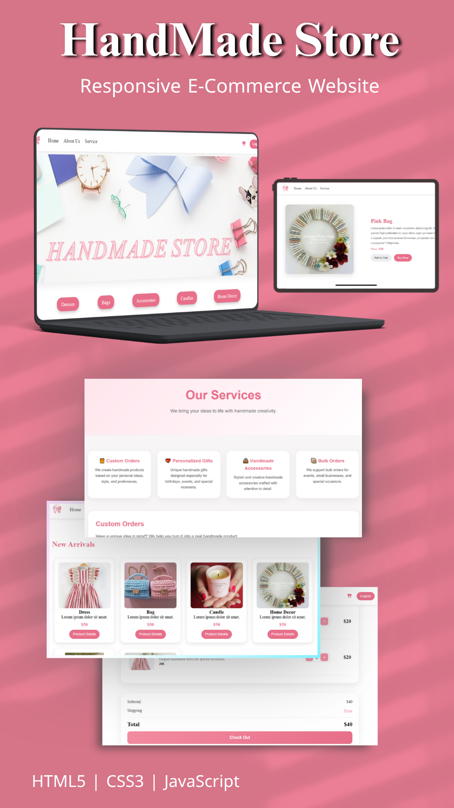
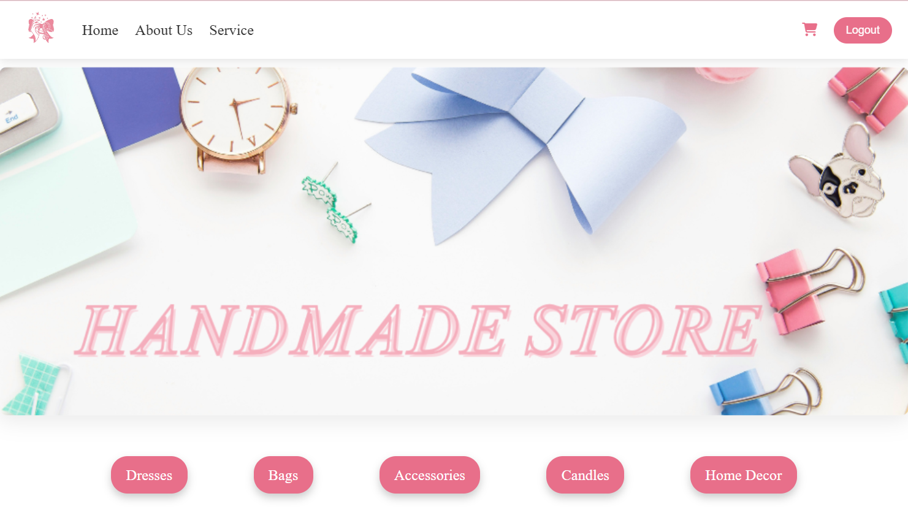
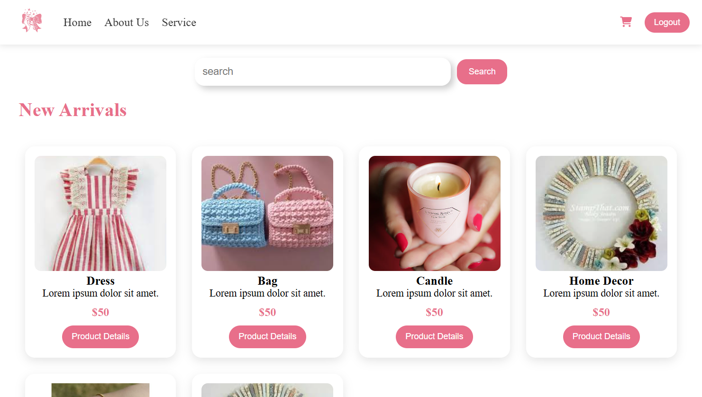
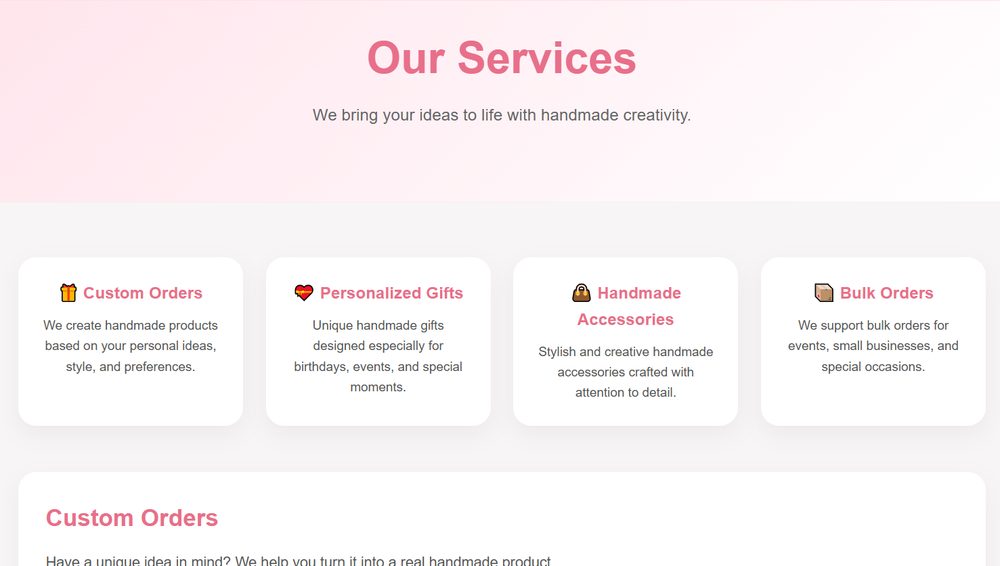
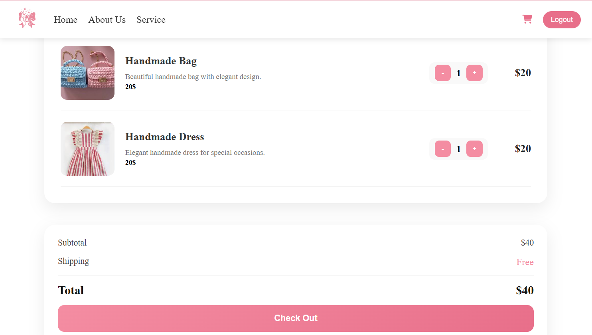

<!-- Hero Image -->

<p align="center">
  
</p>

<h1 align="center">🛍️ HandMade Store</h1>

<p align="center">
A Responsive E-Commerce Website built with HTML, CSS and Vanilla JavaScript.
</p>

---

## 📖 About the Project

HandMade Store is a responsive front-end e-commerce website that simulates a real online shopping experience for handmade products.

The project focuses on creating a clean and modern user interface while providing an interactive shopping experience through JavaScript. It was developed to strengthen my front-end development skills by building a complete multi-page website from scratch.

---

## 🌐 Live Demo

🔗 **Website:** https://hand-made-store-three.vercel.app

---

## 🎯 Project Goals

* Practice responsive web design.
* Improve JavaScript DOM manipulation skills.
* Build a complete multi-page website.
* Create a realistic shopping experience.
* Enhance UI/UX design skills.

---

## ✨ Features

* 🛍️ Product Listing
* 🔍 Search Products
* 📄 Product Details Page
* 🛒 Shopping Cart
* ➕ Add to Cart
* ➖ Remove from Cart
* 🔢 Update Product Quantity
* 💳 Checkout Page
* 📖 About Page
* 🧵 Services Page
* 📱 Fully Responsive Design
* 🎨 Modern and Clean User Interface

---

## 🛠️ Technologies Used

* HTML5
* CSS3

  * Flexbox
  * CSS Grid
* Vanilla JavaScript (ES6)
* Local Storage
* Git & GitHub
* Vercel

---

## 📸 Project Preview

### Home Page

> 

---

### Product Details

> 

---

### Services Page

> 

---

### Shopping Cart

> 

---

## 📁 Project Structure

```text
HandMade_Store/
│
├── css/
├── js/
├── images/
│
├── index.html
├── about.html
├── services.html
├── cart.html
├── checkout.html
│
└── README.md
```

---

## 🚀 Getting Started

Clone the repository:

```bash
git clone https://github.com/menna268/HandMade_Store.git
```

Open the project folder.

Run **index.html** in your browser.

No additional installation is required.

---

## 💡 What I Learned

During this project, I improved my skills in:

* Responsive Web Design
* HTML Semantic Structure
* CSS Flexbox & Grid
* JavaScript DOM Manipulation
* Local Storage
* Building Multi-Page Websites
* Creating Interactive User Interfaces
* Organizing Front-End Projects

---

## 📌 Future Improvements

* 🔐 User Authentication
* ❤️ Wishlist Feature
* 💳 Payment Integration
* 🔎 Advanced Product Filtering
* ⭐ Product Reviews & Ratings
* 📦 Backend Integration (Firebase / Node.js)
* 👤 User Profiles
* 🛠️ Admin Dashboard

---

## 👩‍💻 Author

**Menna Allah Hamada**

Front-End Developer

📍 Asyut, Egypt

GitHub:
https://github.com/menna268

LinkedIn:
www.linkedin.com/in/menna-allah-hamada-gaber-b21393341

---

⭐ If you like this project, feel free to give it a star on GitHub.
